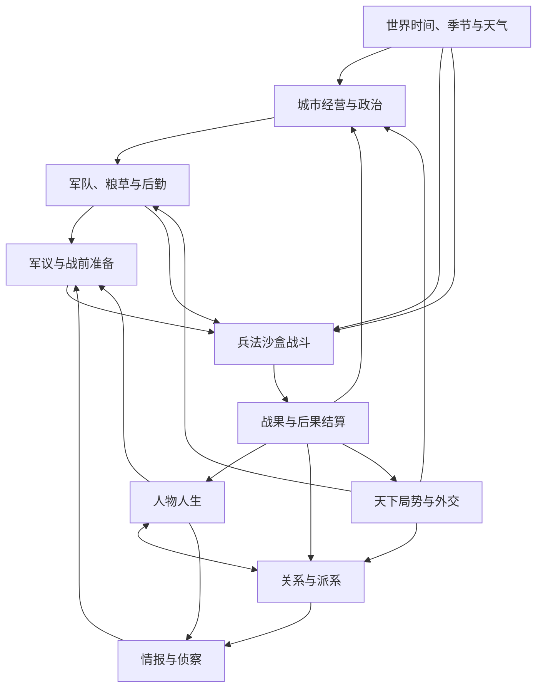

# 系统地图

## 系统层级

## 决策层级

- **人生与战略层**决定玩家拥有什么权限、资源、盟友和长期目标。
- **战役准备层**把长期状态转化为可观察情报、可投入资源和候选条件链。
- **战役执行层**解析玩家明确提交的命令，不替玩家补全缺失计划。
- **后果层**把结果写回持续世界，使胜败都成为下一轮决策的起点。

## 兵法条件链

兵法不是独立系统对象中的“技能效果”，而是多个系统状态被一系列命令连接后的结果：

每条可用兵法路线必须定义：可观察线索、必要条件、增强条件、玩家投入、执行窗口、敌方反制、暴露方式、失败结果和后果写回。系统可以识别条件已经成立，但不能把完整条件链封装成一个无条件按钮。

## 关键状态流

| 来源系统 | 传入战争的状态 | 战争写回的状态 |
|---|---|---|
| 人物人生 | 能力、性格、健康、职责、名声 | 功过、伤病、成长、身份变化 |
| 关系与派系 | 信任、协作意愿、授权、冲突 | 恩怨、忠诚、派系声望、问责 |
| 城市政治 | 粮食、人口、工事、民心、治安 | 损耗、难民、威望、控制权 |
| 外交局势 | 援军、通行、贸易、威胁、时限 | 条约信誉、势力强弱、领土态势 |
| 时间天气 | 季节、昼夜、天气、风向、道路 | 时间推进、灾害与战役窗口变化 |
| 情报侦察 | 敌情置信度、地形知识、误报 | 情报源暴露、知识更新、反侦察线索 |
| 后勤军队 | 兵力、补给、士气、疲劳、军纪 | 伤亡、溃散、缴获、消耗、经验 |

## 权威状态与系统契约

| 权威系统 | 独占写入状态 | 主要消费者 | 概念阶段契约 |
|---|---|---|---|
| 世界时间 | 日期、时段、季节进度 | 全部时序系统 | 只有时间推进命令能前进；不能由 UI 或单个系统私自跳时 |
| 环境 | 天气、风向、道路状态 | 情报、后勤、战斗 | 由种子、配置和时间确定；玩家只通过预测和准备间接应对 |
| 人物 | 能力、性格、健康、身份、职责 | 关系、军议、命令执行 | 人物状态变化产生可追踪原因，不由战斗临时复制角色数值 |
| 关系派系 | 信任、恩怨、义务、派系立场 | 授权、情报、执行、后果 | 不压缩成单一好感值；向消费者提供意愿与约束结果 |
| 城市政治 | 粮食、民心、治安、工事、控制权 | 后勤、征募、防御、失败延续 | 战争投入必须消耗城市可见资源并留下后果 |
| 外交局势 | 条约、信誉、通行、援助、威胁 | 战略窗口、后勤、援军 | MVP 只暴露一个受控入口，不运行完整天下外交模拟 |
| 情报 | 报告、来源、时效、置信度 | 玩家、军师、战前准备 | 玩家投影只读已知信息，不泄露世界真值 |
| 军队后勤 | 单位状态、补给、士气、疲劳、军纪 | 战前准备、战役执行 | 每个变化有来源与时段，资源不凭空出现 |
| 战役 | 区域占据、命令承诺、战役事件 | 后果结算、复盘 | 同一快照、配置、种子与命令流必须可复现 |
| 后果结算 | 跨系统变更集合 | 各权威系统 | 先生成变更计划并校验，再原子写回，不产生半结算状态 |

## 跨系统结算顺序（全局破环权威声明）

系统层级图近似 DAG，但部分系统存在生产者/消费者**双向依赖**（互列对方为依赖属正常，
非 stale）。为保证确定性与避免循环结算，破环采用**固定全局顺序**，同一时刻不允许两系统互相读对方的未结算值：

- **002↔003（天气/地图）**：地图地形标签是**静态输入**，天气先读地形派生道路；地图的通行耗时再读天气的**已结算修正**。顺序：地形（静态）→ 天气 → 地图通行。
- **005↔006（人物/关系）**：关系事件以人物为主体写入；人物的执行意愿读关系的**已结算 coop_score**。顺序：关系事件结算 → 人物意愿/质量。
- **005↔011 / 010↔011 / 010↔012**：战斗内由 GDD_010 §2 管线固定顺序（命令验证→移动/接触→侦测→交战→损耗→**士气/疲劳/军纪**→触发/撤退→事件）；断粮传导单一权威见 GDD_011 §1/§2。
- **014↔015↔004↔016（Meta 层破环，权威 2026-06-28）**：四者互读对方态势，破环规则——**城池归属唯一权威为 004**（ADR-0008，独占 ControlChanged）；`cities_owned` 是 004 已结算归属的**只读投影**，014 与 015 均读它、**不互读对方未结算值**。本边界内所有控制权变更请求（战役失城/夺城、历史事件 owner_change、自立倒戈）先由 004 单点结算，Meta 层再读已结算值。故 014↔015 的环经"双方都读 004 已结算 cities_owned"破除。

**日界（时段/日边界）跨系统结算顺序**（权威定义于 GDD_001 §Main Rules）：
**时间推进 → 环境（GDD_002）→ 补给（GDD_012）→ 城市/控制权（GDD_004，本边界所有 ControlChange 单点结算）→ 状态事件（GDD_011 等）→ 〔Meta 层〕历史世界模型（GDD_015：事件触发/分叉/reachable 重算，读已结算 004 归属）→ 生涯（GDD_014：功绩/晋升/自立/失城罢官结算，读已结算 004+015）→ 敌方 AI（GDD_016：决策取值，读已结算 011/012/015）**。
- 补给先于城市结算意味着：运输**不能消费同边界城市的新产粮**（base_yield 当边界产入次边界方可调拨），此为有意约束。
- **Meta 层置于基础层之后**：015/014/016 只读基础层（004/011/012）与彼此的**已结算**值；任何 Meta 层发起的归属变更不在本边界即时回读，经 004 在下一结算点单点落地（ADR-0008），保证同一存档同一行动序列→同一结果（ADR-0004 确定性硬锁）。
- 各系统**内部**结算顺序（如城市日结账本、士气事件聚合）在全局顺序内自洽，不得跨系统反向读未结算值。

## 军师建议边界

军师读取的只能是玩家阵营合法持有的情报投影、人物认知和公开状态。建议输出包含：观察、假设、所需条件、主要风险、缺失情报和军师置信度。军师不输出隐藏真值、不保证结果、不自动选定最终方案，也不提交部署命令。

## 命令与因果链

玩家意图必须经过“输入 → Command → Application Service → Domain Rule → Domain Event → 后果投影”进入核心状态。UI 只能展示状态并提交意图，不能直接改写 gameplay state。

## Vertical Slice 最短闭环

小城防御场景覆盖：时间天气、城市状态、人物与关系、侦察、军议、战前准备、士气疲劳、补给和战斗后果。外交在切片中只保留一个能改变援军或时限的受控入口，避免扩张成完整天下模拟。

### Slice 系统分级

- **完整闭环**：时间、基础环境、人物、关系、城市、情报、军议、战前准备、后勤、士气疲劳、战役解析、后果、存档。
- **受控接口**：外交只提供一个既定承诺或求援入口；世界地图只提供小城、敌营、补给线与有限区域网络。
- **静态背景**：完整天下 AI、官僚、贸易、家族、历史事件网络不运行，只作为场景前提。

### Slice 最小条件链

1. **假退伏击**：获知敌将鲁莽倾向 → 选择诱敌人物与部队 → 保持己军军纪 → 选择伏击区域与时机 → 敌军判断并可能追击 → 伏兵在未暴露时介入。
2. **断粮疲敌**：侦察补给路线 → 投入袭扰队与时间 → 承担城防减弱风险 → 敌补给状态按时段恶化 → 士气与行动选择发生变化。
3. **守城待变**：保存兵力与粮草 → 修整工事和军纪 → 利用天气或外交时限 → 承担城市消耗和民心压力 → 等待敌军疲劳或撤退窗口。

夜袭是执行手段，可与上述条件链组合，不作为点击即生效的独立技能。

## 系统复杂度约束

- 每个跨系统影响都必须有明确生产者、消费者和可测试契约。
- 不允许用隐藏全局修正代替可解释状态。
- MVP 中每个系统只实现支撑核心假设的最短路径。
- 同一信息必须有唯一权威来源，显示层使用只读投影。
- 任一战果解释优先展示不超过五个决定性因素，其余细节允许展开查看。
- MVP 中每条条件链最多依赖少量核心系统；若需要同时追踪全部系统才能理解，则必须拆分或简化。
- 新增跨系统连接必须说明它改变了哪个玩家决策，不能只增加被动修正。

## GDD 责任分派

- 时间尺度与跨层换算：GDD_001、GDD_002。
- 区域/路线拓扑与可达性：GDD_003。
- 城市战争承受力：GDD_004、GDD_012。
- 外交受控入口（支柱4 在 slice 的唯一落点）：GDD_012 §8（求援/求粮/求时限，外势力为静态背景，非完整天下外交模拟）。
- 人物视角、性格、关系与执行：GDD_005、GDD_006。
- 情报真值、报告与建议边界：GDD_007、GDD_008。
- 条件承诺与战役解析：GDD_009、GDD_010、GDD_011。
- 权威状态快照与回放：GDD_013。
