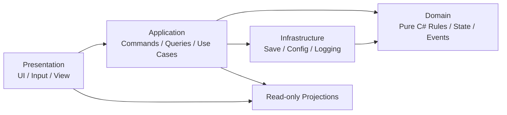

# 技术架构初稿

## 状态与目标

本文档建立架构边界，不授权 gameplay 实现。目标是在 Unity 中保留纯 C#、可确定性、可测试、数据驱动的核心模拟。

## 技术基线

- 引擎：Unity，具体 LTS 版本在创建工程时锁定。
- 语言：C#。
- 运行形态：离线单机。
- 配置：ScriptableObject 用于编辑体验，构建时转换为经过校验的不可变 Domain 配置；JSON 用于外部数据、存档和未来 Mod 边界。
- 测试：纯 C# Domain 单元测试为主，Unity EditMode/PlayMode 测试覆盖适配与场景集成。

## 分层

### Domain Layer

纯 C# 权威状态与规则，不依赖 UnityEngine、MonoBehaviour、Scene、UI、文件系统或系统时间。随机性只能通过显式注入的确定性随机源或预生成随机流进入。Domain 产生结果与 Domain Events，不直接播放表现或写文件。

### Application Layer

接收 Commands，校验调用上下文，编排 Domain 操作、事务边界、存档与投影更新。Queries 返回只读 DTO，不泄露可变 Domain 对象。

### Infrastructure Layer

负责配置加载与校验、存档序列化和迁移、日志、平台文件路径及 Unity 适配。基础设施实现由上层定义的接口，不拥有 gameplay 规则。

### Presentation Layer

MonoBehaviour、UI、输入和 Scene 组织。它只能提交 Command、执行 Query、订阅只读投影和 Domain Event 映射，不能直接修改核心状态。

## 状态变更协议

1. Presentation 构造玩家意图 Command。
2. Application Service 验证身份、时机和前置输入。
3. Domain 使用当前状态、已验证配置和显式随机上下文解析命令。
4. Domain 返回结构化结果与事件；失败返回稳定错误码，不产生部分写入。
5. Application 原子提交状态，更新投影并触发存档策略。
6. Presentation 根据投影和事件展示结果。

## 数据驱动规则

- 所有可平衡数值必须来自版本化配置，不允许写在方法体中。
- 配置含稳定 ID、schema version、单位、合法范围和交叉引用。
- 进入 Domain 前完成解析、默认值展开和完整校验。
- 存档记录使用的配置版本或兼容指纹；配置不兼容时给出明确错误或迁移路径。

## 确定性

- 战斗模拟由初始快照、配置指纹、随机种子和有序命令流唯一决定。
- 禁止在 Domain 使用浮动帧时间、无序集合迭代、系统区域设置或隐式全局随机。
- 若浮点跨平台一致性无法证明，核心结算采用整数、定点或明确量化规则。
- 每次战役保存可重放输入与关键状态哈希，支持复现差异。

## 存档边界

存档必须含 schema version、游戏版本、配置指纹、世界状态、Domain 时钟、随机状态、命令序列检查点和校验信息。加载顺序为读取头部、验证兼容、迁移副本、校验引用、构造 Domain、验证不变量，最后原子替换当前会话。

## 错误与可观测性

- 预期失败使用稳定错误码和参数，不依赖 UI 文案。
- Domain invariant 破坏必须停止提交并记录确定性诊断上下文。
- 诊断日志不得成为 gameplay 状态来源。
- 玩家可见结果需要“来源 → 修正 → 结果”的解释数据，但隐藏情报不得泄露。

## 测试边界

- 每个 public Domain/Application method 在 method spec 中列出契约与测试。
- Domain 单测覆盖正常、边界、失败、无副作用和确定性。
- 契约测试覆盖配置与存档适配器。
- 集成测试覆盖 Command 到 Projection 的完整路径。
- 关键战役使用 golden scenario 与 replay hash 做回归。

## 依赖方向规则

Domain 不依赖其他层；Application 依赖 Domain 与抽象端口；Infrastructure 实现端口；Presentation 依赖 Application API 和只读 DTO。任何反向依赖必须先新增 ADR。

## 尚未授权的决定

程序集定义、DI 容器、序列化库、定点数实现、事件总线和 Unity LTS 版本必须在相关 ADR 或 method spec 中锁定，不在本初稿中暗定。
