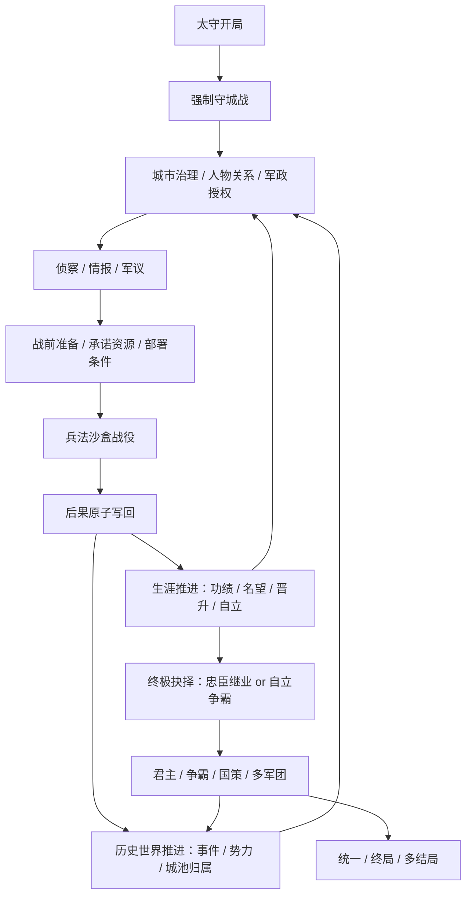

# 完整游戏循环模块化规划（合成权威稿）

**日期**：2026-06-28（合成版：2026-06-28 合并三份来源后带进 main）
**状态**：Draft for Review（待子代理重新评审 → 通过后部分裁定可锁定）
**范围**：完整游戏循环模块规划；不授权 gameplay code、不创建 Unity scene、不改 `src/` / `Assets/` / `tests/`。
**依据**：`design/gdd/game-concept.md`、`design/gdd/game-pillars.md`、`design/gdd/systems-index.md`、`docs/reviews/full-game-review-2026-06-28.md`、`docs/architecture/control-manifest.md`。

> **合成说明（本文件为三份来源的最优合并，2026-06-28）**：
> 1. **骨架** = 本文件原 codex 模块计划（M00–M16 循环模块 + 双层管理 + §11 Production Gate 五裁决 + §9 设计文档清单 + §8 agent 视角）。
> 2. **注入 `roadmap-playable-assembly-2026-06-28.md`（已被本文件取代）**：设计状态分层 + 与已完成评审/9 项修复的挂钩——见 §3.5「与已完成工作的接口（FIX 地基）」。
> 3. **注入 `milestones/mvp-roadmap-2026-06-23.md`**：MVP 硬验收指标 + Kill Criteria + 「明确不做」范围纪律 + **竖切战斗层未接线实况**——见新增 §5b。
> 关键修正：原 codex 计划与旧 roadmap 都把战役当"能产出结果的黑盒"；6-23 路线图实况显示**竖切的战前准备/完整战役/部队士气/跨系统后果（B2/B3/B4/B5）尚未接进可玩切片**——本合成版把它显式补进 §5b 与 §7 瓶颈。

> **2026-06-30 终盘方向修订**（依据 `docs/reviews/endgame-direction-decision-2026-06-30.md`）：
> 1. **M13/M14 重定义**：由"君主争霸 / 统一终局（4X 框架）"改为 **M13 生涯结局与传承 / M14 人生落幕与史册**。骨架 = 一段三国人生（主角是**人**：会死、可传承、多结局、失败不删档）。**争霸、战略 AI、问鼎天下皆保留**——作为人生后期走向与最难结局；**只去掉 4X 框架**（主角是不死势力 / 统一是唯一目的 / 输了删档）。问鼎线的**战略 AI = ADR-0006 反全知/可骗的战略层延伸**（分期到后期，非降级）。
> 2. **科技政策决策**：**不设君主全局科技树（Reject）**；"治理方针"（重农/重商/重武/安民等数据驱动方向选择）**并入 M03/M12 城市治理**，作为"喂给战争的筛选尺子"延伸，不占独立模块。
> 3. M00–M10 全部保留、零返工；全部强制设计锁保留（C 方向下更自洽）。

---

## 0. 本次使用的 skills / agents 规则

本规划按 Claude Code Game Studios 的以下技能与 agent 职责口径执行：

- `map-systems`：从概念抽取系统、识别隐含系统、分层依赖、标记瓶颈与设计顺序。
- `design-review`：按完整性、依赖图、实现可行性、支柱一致性检查本规划。
- `scope-check`：防止“完整游戏”规划把所有内容一次性塞进同一个开发批次。
- `create-epics`：把模块规划拆成将来可落地的 epic 结构，但本文件不直接创建 story。
- `producer` 视角：检查阶段可生产性、依赖顺序、scope fallback。
- `creative-director` 视角：检查完整循环是否仍服务“兵法沙盒三国人生大战略”，而不是滑向全知君主面板。
- `game-designer` / `systems-designer` 视角：检查每个模块是否有明确输入、输出、反馈环和可调平衡杠杆。
- `technical-director` / `lead-programmer` 视角：检查权威状态、Application 会话边界、确定性、存档和跨系统接口。
- `qa-lead` 视角：要求每个模块都有可验证的端到端证据，而不是只靠单系统单测。

当前 `production/review-mode.txt = lean`，按 `director-gates.md`，非 phase-gate 不实际 spawn Claude director gates。本 Codex 环境也不能原生调用 Claude Code 的 Task agent 类型；因此本文件记录的是“按对应 agent 职责执行的人工评审视角”，不等同于 Claude Code full-mode formal gate。若本规划获用户认可，建议随后在 Claude Code 中运行正式 `/gate-check systems-design --review full` 或等价流程。

---

## 1. 规划目标

现有 `production/roadmap-playable-assembly-2026-06-28.md` 已给出 A→E 大阶段，但仍偏“从首个可测游戏开始铺开”。本文件补足另一层：**完整游戏循环的模块化结构**。

目标不是只定义最小可玩范围，而是回答：

1. 整个游戏从太守开局到统一/终局，由哪些可独立设计、测试、实现、平衡的模块组成？
2. 每个模块在玩家循环中承担什么职责，输入来自哪里，输出写回哪里？
3. 哪些模块已有 GDD/ADR/epic，可直接装配；哪些模块必须先补 GDD/ADR？
4. 开发顺序如何既能逐步可玩，又不把完整游戏愿景砍成“只做 MVP”？
5. 哪些模块是瓶颈，必须先建立接口，否则后续系统会继续成为孤岛？

---

## 2. 完整游戏循环总图

完整游戏不是一个线性流程，而是三层循环叠加：

核心约束：

- 玩家不是全知势力面板，始终通过身份、权限、情报和关系进入世界。
- 太守阶段、掌权阶段、君主阶段的权限扩大，但不取消不完全情报。
- 战斗结果必须写回城市、人物、关系、外交、世界历史和生涯状态。
- 任何“计策”都必须仍然是条件链，不因进入后期就退化成技能按钮。

---

## 3. 模块分层总览

### 3.1 Foundation / 已完成内核

这些模块已经有实现与测试，是完整循环的底座，不应重做：

| 模块 | 对应 epic / GDD | 完整游戏职责 | 当前状态 |
|---|---|---|---|
| 时间与确定性时序 | epic-002 / GDD_001 | 提供日界、时段、事件全序、跨系统结算顺序 | ✅ Complete |
| 环境与天气 | epic-002 / GDD_002 | 影响道路、侦察、补给、战役条件 | ✅ Complete |
| 世界拓扑 | epic-002 / GDD_003 | 区域/路线/可达性，未来扩展全图 | ✅ Complete（切片深度） |
| 存档与复现 | epic-009 / GDD_013 | 所有权威状态的版本化保存、迁移和复现 | ✅ Complete（需全局会话整合） |
| 分层架构 | ADR-0002 | Domain/Application/Infrastructure/Presentation 边界 | ✅ Accepted |
| 确定性模拟 | ADR-0004 | 状态哈希、定点、随机流、回放 | ✅ Accepted |

### 3.2 Core / 已完成内核

这些模块是战争与人生循环的规则引擎：

| 模块 | 对应 epic / GDD | 完整游戏职责 | 当前状态 |
|---|---|---|---|
| 人物与关系 | epic-003 / GDD_005/006 | 角色身份、职责、关系、执行意愿、政治后果 | ✅ Complete |
| 城市与控制权 | epic-004 / GDD_004/012 | 粮食、民心、工事、控制权、补给入口 | ✅ Complete |
| 情报与军议 | epic-005 / GDD_007/008 | 真值/知识分离、报告、建议边界 | ✅ Complete |
| 战前准备 | epic-006 / GDD_009 | PlanDraft、承诺、冲突 DAG、原子提交 | ✅ Complete |
| 战役解析与士气 | epic-007 / GDD_010/011 | 条件链、战役事件、士气/疲劳/军纪 | ✅ Complete |
| 后果与失败延续 | epic-008 / GDD_010 后果 | 跨系统变更集、失败可继续 | ✅ Complete |

### 3.3 Meta / 已完成但未装配

这些模块已经实现内核，但没有进入完整可玩会话：

| 模块 | 对应 epic / GDD | 完整游戏职责 | 当前状态 |
|---|---|---|---|
| 生涯与晋升/自立 | epic-011 / GDD_014 | 太守人生、忠臣线、自立触发、在野延续 | ✅ Complete；未装配进 GameSession |
| 条件历史世界模型 | epic-012 / GDD_015 | 历史事件、分叉、势力存续、归属投影、抽象结算 | ✅ Complete；未装配进 GameSession |
| 敌方 AI | GDD_016 / ADR-0006 | 战术对手、势力策略、AI 认知与可复现决策 | ⚠️ GDD/ADR 已有；无 epic/story/代码 |

### 3.4 Full Game / 需要补设计

这些是“完整游戏能通关”的关键，但当前多处还只是 Future Scope：

| 模块 | 当前来源 | 是否可直接实现 | 原因 |
|---|---|---|---|
| 完整官阶 0–7 权限差异 | GDD_014 Future | ⚠️ 需补 GDD 细则 | 已有 Rank 枚举，但每阶权限、兵权、治理范围未完整设计 |
| 多城治理与战区管理 | GDD_004/014/015 Future | ⚠️ 需深化 | 单城逻辑已有，多城权限、委任、军团协作未完整 |
| 全图历史事件网络 | GDD_015 Future | ⚠️ 需内容设计 | 机制已有，缺全量事件数据、分叉深度规则 |
| 全势力战略 AI | GDD_016 Future | ⚠️ 需 epic + 分层 | 战术 AI 尚未实现，战略 AI 不应先做 |
| 完整外交 | GDD_012 §8 扩展 | ⚠️ 需新 GDD 或扩展 GDD | 当前只有受控入口，不能直接变成完整天下外交 |
| 君主级玩法 | GDD_014 Future | ❌ 需 GDD_017+ / ADR | 成为君主后的国策、任命、势力经营未设计 |
| 自立争霸 | GDD_014 Future | ❌ 需 GDD_017+ / ADR | 自立后势力合法性、外交、扩张、内政边界未设计 |
| 统一胜利与终局 | 概念层 | ❌ 需 GDD_017+ / ADR | 胜利条件、多结局、结局评分与可继续边界未设计 |

---

### 3.5 与已完成工作的接口（M00 的现成地基，注入自 full-game-review 修复）

M00 CampaignSession 不是从零起步——以下已落地的成果是它的直接地基：

| 已完成 | 提交 | 对 M00 的作用 |
|---|---|---|
| **FIX-2 全局结算顺序**（systems-index Meta 层 014/015/016 入序 + 破环） | `4b389e4` | M00 日界推进直接复用此顺序，无须重定 |
| **FIX-9 Meta 跨系统链端到端测试**（守城败→004→世界投影，3 测） | `e993847` | M00 目标循环 E2E 的起点；已证 epic-011↔004↔epic-012 经事件可贯通 |
| **FIX-8 战役存档统一信封 CampaignSaveCodec**（生涯段+世界段单一信封） | `e993847` | M00 的 Save Snapshot 组装直接用它，再并入战役段 |
| **FIX-3 gdd-016 设计缺陷修复**（悬空引用/负 softmax/lerp 钳） | `4b389e4` | M08 敌方 AI 实现前置已清 |
| **FIX-4 自立新势力权威裁定**（015 为势力创建唯一权威） | `4b389e4` | M09/M10 自立线写回边界已定 |

> 结论：M00 的"日界推进 / 跨系统写回 / 统一存档"三件地基已有可用件，装配是**接线 + E2E**，不是从零造。

---

## 4. 完整游戏模块目录

### M00 — CampaignSession 完整会话骨架

**职责**：把 Career / World / CityControl / Battle / Save / Presentation 投影接成一个可运行的长期会话。

| 字段 | 内容 |
|---|---|
| 玩家体验 | 玩家从“一个人一座城”进入世界，而不是选择一局孤立战役 |
| 权威状态 | 当前会话、世界时间、CareerState、WorldState、CityControl、Battle checkpoints、Save envelope |
| 输入 | 新开局配置、读档、玩家 Command、日界推进、战役结果 |
| 输出 | 更新后的会话快照、只读投影、可存档状态、下一步合法行动 |
| 依赖 | epic-001~012，ADR-0002/0004/0005/0008 |
| 风险 | 会话层成为 God Object；必须只编排，不拥有规则 |
| 建议 epic | `epic-013-campaign-session-assembly` |
| 测试证据 | 目标循环 E2E：守城胜/败 → 控制权 → 世界 → 生涯 → 存档 round-trip |

这是完整游戏的脊梁。没有它，所有后续系统仍会继续是孤岛。

### M01 — Scenario / Campaign 配置与内容目录

**职责**：把硬编码 `SliceScenario` 替换为可验证、可扩展、可存档兼容的开局与战役目录。

| 字段 | 内容 |
|---|---|
| 玩家体验 | 不同城池、势力、历史时间点开局各不相同 |
| 权威状态 | ScenarioCatalog、CampaignStart、CitySeed、FactionSeed、BattleCatalog |
| 输入 | ScriptableObject / JSON 编辑数据，经构建校验转不可变配置 |
| 输出 | 可创建 CampaignSession 的纯配置快照 |
| 依赖 | ADR-0003、GDD_003/004/014/015 |
| 风险 | 配置层过早追求全量数据，拖慢装配 |
| 建议 epic | `epic-014-scenario-catalog` |
| 测试证据 | 配置缺字段/错引用被拒；同一 config fingerprint 可复现 |

### M02 — Opening Governor Loop（太守开局循环）

**职责**：完整串起“太守开局 → 强制守城 → 胜败后果 → 可继续游戏”。

| 字段 | 内容 |
|---|---|
| 玩家体验 | 第一小时即感到：我是一名太守，我守住或失去的是自己的城 |
| 权威状态 | CareerState、RetinueState、CityControl、WorldCityProjection、OutcomeContinuation |
| 输入 | 开局城池、核心僚属、敌军围城、玩家部署、BattleOutcome |
| 输出 | 胜利后的城池权限 / 失败后的在野延续 |
| 依赖 | M00、M01、epic-008/011/012 |
| 风险 | 只做成“教程战斗”，没有人生延续感 |
| 建议 epic | `epic-015-opening-governor-loop` |
| 测试证据 | 胜败两路都能进入下一天，且可存档/读档 |

### M03 — City Governance Loop（城市治理循环）

**职责**：让城市经营成为战争条件来源，而非独立经营小游戏。

| 字段 | 内容 |
|---|---|
| 玩家体验 | 玩家为战争准备而治理城市：粮、民心、工事、治安、情报网络都有取舍 |
| 权威状态 | CityState、SupplyState、PublicOrder、Fortification、RecruitmentPool |
| 输入 | 政令、分配官员、征募、修工事、征粮、安抚、贸易/求援入口 |
| 输出 | 补给能力、守城强度、情报质量、民心风险、战后恢复速度 |
| 依赖 | GDD_004/005/006/012，M00 |
| 风险 | 变成三国志式全量城市经营；必须保留“喂给战争/生涯”的筛选尺子 |
| 建议 epic | `epic-016-city-governance-loop` |
| 测试证据 | 至少三条治理选择改变战役条件，且有可解释代价 |

### M04 — Intelligence / War Council Loop（情报与军议循环）

**职责**：让玩家在不完全信息下判断风险，军师只提出条件化建议。

| 字段 | 内容 |
|---|---|
| 玩家体验 | 胜利来自判断与验证，而不是系统告诉玩家最优解 |
| 权威状态 | WorldTruth、Observation、IntelReport、FactionKnowledge、CouncilSnapshot |
| 输入 | 侦察、间谍、斥候、关系渠道、历史公开态势 |
| 输出 | 带置信度和时效的建议、缺失情报、可能条件链 |
| 依赖 | GDD_007/008/016，M00/M03 |
| 风险 | 军师建议过度接近攻略；或情报 UI 泄露真值 |
| 建议 epic | `epic-017-intel-council-loop` |
| 测试证据 | 军师在同一知识快照下输出确定；知识变化后旧建议过时 |

### M05 — War Preparation / Commitment Loop（战役准备循环）

**职责**：把人物、资源、情报、时间转成可追踪的计划承诺。

| 字段 | 内容 |
|---|---|
| 玩家体验 | 兵法条件是提前创造出来的，不是开战后临时点击 |
| 权威状态 | PlanDraft、CommittedPlan、ResourceCommitment、TimeWindow、OrderDependencyGraph |
| 输入 | 伏兵、断粮、修工事、诱敌、夜袭、求援、撤退准备 |
| 输出 | 可执行战役初始条件、资源锁定、暴露风险、失败预案 |
| 依赖 | GDD_009/010/012，M03/M04 |
| 风险 | 准备阶段过重，玩家疲劳；需要模板和复盘辅助，但不能自动布阵 |
| 建议 epic | `epic-018-war-preparation-loop` |
| 测试证据 | 冲突 DAG 拒绝非法计划；合法计划原子提交；失败无部分写入 |

### M06 — Tactical Battle Loop（兵法沙盒战役循环）

**职责**：解析战区中的命令、条件链、AI 反应和战役后果。

| 字段 | 内容 |
|---|---|
| 玩家体验 | 玩家通过地形、时间、补给、人心、天气、纪律等杠杆创造胜机 |
| 权威状态 | BattleSnapshot、BattlePhase、TacticRecognizer、CohesionState、SupplyCutoffState、EnemyAiDecision |
| 输入 | CommittedPlan、阶段命令、侦察结果、敌方 AI 意图 |
| 输出 | BattleEvents、TacticTags、Casualties、Morale/Fatigue changes、OutcomeCandidates |
| 依赖 | GDD_010/011/012/016，M05，M08 |
| 风险 | 无敌方 AI 时战斗只是脚本靶子；有 AI 后必须防全知与不可复现 |
| 建议 epic | `epic-019-tactical-battle-loop` |
| 测试证据 | 同一快照/配置/种子/命令流产生同一 hash；兵法只作为事后标签 |

### M07 — Consequence / Recovery Loop（后果与恢复循环）

**职责**：把战果写回完整世界，并保证胜败都打开后续选择。

| 字段 | 内容 |
|---|---|
| 玩家体验 | 战争改变人生和世界；失败不是删档，而是进入新局面 |
| 权威状态 | ConsequenceSet、CareerDelta、CityDelta、RelationshipDelta、WorldDelta、ContinuationOptions |
| 输入 | BattleOutcome、城市控制权请求、人物伤亡、声望变化、外交影响 |
| 输出 | 原子写回后的新会话、后续合法行动 |
| 依赖 | epic-008/011/012，ADR-0008，M00/M06 |
| 风险 | 写回过宽导致事务难测；写回过窄导致战斗不影响世界 |
| 建议 epic | `epic-020-consequence-recovery-loop` |
| 测试证据 | 任一目标校验失败整批回滚；胜/败/撤退/失城都有后续 |

### M08 — Enemy AI Loop（敌方 AI 循环）

**职责**：给兵法沙盒提供可读、可骗、可复现的对手。

| 字段 | 内容 |
|---|---|
| 玩家体验 | 敌将有性格、有误判、有适应，但不是全知机器 |
| 权威状态 | AiWorldView、OpponentModel、StrategicAction、TacticalDecision、MemoryTrace |
| 输入 | AI 阵营知识、敌将性格、当前态势、历史记忆、命令窗口 |
| 输出 | 战术动作、战略倾向、追击/撤退/补给/诱敌反应 |
| 依赖 | GDD_016、ADR-0006、GDD_007/010/011/012/015 |
| 风险 | 先做战略 AI 会膨胀；应先做战术层便宜 80% |
| 建议 epic | `epic-021-enemy-ai-loop` |
| 测试证据 | AI 不读真值；同种子 softmax 可复现；极端性格不产生负温度或越界插值 |

### M09 — Career / Authority Loop（生涯与权限循环）

**职责**：让玩家从太守走向高阶官职、自立或流亡，不让战斗成为唯一成长来源。

| 字段 | 内容 |
|---|---|
| 玩家体验 | 玩家通过功绩、名望、关系和政治判断逐渐获得更大权限 |
| 权威状态 | CareerState、RankPermission、LordStanding、MeritLedger、RebellionState、RetinueState |
| 输入 | 战果、政绩、君主任命、关系支持、城市得失、任务表现 |
| 输出 | 官阶、兵权、治理范围、可发起行动、自立资格、在野路径 |
| 依赖 | GDD_014，M03/M07/M10 |
| 风险 | 官阶只是数值门槛；必须带来不同玩法边界 |
| 建议 epic | `epic-022-career-authority-loop` |
| 测试证据 | 非战斗功绩源速率可竞争；晋升/自立失败返回稳定错误码 |

### M10 — Historical World / Faction Loop（历史世界与势力循环）

**职责**：让天下大势沿演义推进，同时允许玩家触及范围内改写历史。

| 字段 | 内容 |
|---|---|
| 玩家体验 | 玩家活在真实推进的三国世界里，够不着的历史继续，够得着的历史分叉 |
| 权威状态 | WorldState、HistoricalEvent、ReachabilityGraph、FactionRecord、CityOwnershipProjection |
| 输入 | 时间推进、控制权变化、玩家势力扩张、历史事件前置条件 |
| 输出 | 历史事件触发/分叉、势力存续、抽象结算、世界态势投影 |
| 依赖 | GDD_015、ADR-0007/0008，M00/M07/M08 |
| 风险 | 全量历史数据会压垮生产；需按时代/区域包分批加载 |
| 建议 epic | `epic-023-historical-world-faction-loop` |
| 测试证据 | 同一行动序列同一历史走向；够不着事件前置恒成立；触及后分叉传播 |

### M11 — Diplomacy / Strategic Constraint Loop（外交与战略约束循环）

**职责**：把势力关系、联盟、通行、求援、威胁变成战争边界。

| 字段 | 内容 |
|---|---|
| 玩家体验 | 外交不是菜单刷好感，而是改变战争窗口和代价 |
| 权威状态 | TreatyState、FactionReputation、AccessRights、AidCommitment、ThreatRecord |
| 输入 | 求援、求粮、停战、通行、威胁、背约、君主任务 |
| 输出 | 援军、时限、后勤通道、信誉后果、敌对升级 |
| 依赖 | GDD_012 §8、GDD_015/016，M03/M10 |
| 风险 | 直接做完整外交会变成全知势力模拟；须保持玩家身份权限 |
| 建议 epic | `epic-024-diplomacy-strategic-constraints` |
| 测试证据 | 至少一种外交行动改变战役兵力/时间/后勤；背约有可解释代价 |

### M12 — Multi-City / Theater Loop（多城与战区循环）

**职责**：当玩家掌权后，将单城循环扩展到多城、多路军、多战区。

| 字段 | 内容 |
|---|---|
| 玩家体验 | 玩家不再只守一城，而是负责一片战区，仍受人、粮、令、情报限制 |
| 权威状态 | TheaterState、ArmyGroup、DelegatedGovernor、MultiCitySupplyNetwork、CommandAuthority |
| 输入 | 任命、调兵、战区命令、城市协同、路线补给 |
| 输出 | 战区作战计划、多城资源流、军团行动、局部失控风险 |
| 依赖 | M03/M05/M09/M10/M11 |
| 风险 | 复杂度指数膨胀；必须先定义权限层级和委任机制 |
| 建议 epic | `epic-025-multi-city-theater-loop` |
| 测试证据 | 多城资源守恒；委任 AI 不越权；玩家信息仍不全知 |

### M13 — Career Endings & Succession Loop（生涯结局与传承循环）

> **2026-06-30 重定义**（原"君主与争霸 Sovereign/Hegemony"）：依据 `docs/reviews/endgame-direction-decision-2026-06-30.md`。骨架=一段三国人生；**争霸/战略AI/问鼎皆保留**（作为人生走向与最难结局），只去掉 4X 框架（主角是不死势力/统一唯一目的/输了删档）。

**职责**：把太守→都督→自立的人生**收口为多结局 + 传承**——主角终会谢幕，但人生有多种有分量的结局，基业可传给继承人续玩；不是空虚 game over。

| 字段 | 内容 |
|---|---|
| 玩家体验 | "我这一生如何被三国记住"；主角谢幕触发传承或史册定格，多结局皆有意义 |
| 权威状态 | CareerEndingBranch、SuccessionState、HeirState、LegacyRecord |
| 输入 | 生涯轨迹(M09)、关系、自立/争霸进度、寿命/战死、玩家主动收尾 |
| 输出 | 多结局判定（忠臣善终/开基立业/问鼎天下/功败垂成/功成身退/殉节）、继承人接棒、基业延续 |
| 依赖 | M09/M10/M11/M12；问鼎结局额外依赖战略AI（下行） |
| **争霸线与战略AI** | 问鼎天下=最难结局，需势力级战略AI对手=**ADR-0006（反全知/可骗/确定性）的战略层延伸**（可被离间/伪情报/声东击西瓦解）；时机在问鼎线后期（**分期≠降级**），**非** 4X 全知调度AI |
| 风险 | 结局做不好会虎头蛇尾；失败必须可继续（传承/定格），不切死局 |
| 建议 epic | epic-026 **重定位**；先建 `GDD_017-career-endings-succession.md` + ADR |
| 测试证据 | 六种结局互斥且可达；传承后基业延续；失败不删档；问鼎线战略AI遵守 GDD_007 反全知 |

### M14 — Life Closure & Chronicle Loop（人生落幕与史册循环）

> **2026-06-30 重定义**（原"统一与终局 Victory/Ending"）：依据同上决策记录。终局不是"统一胜利"，而是"一段人生的落幕与史册定格"——"滚滚长江东逝水，浪花淘尽英雄"。

**职责**：定义人生如何落幕、史册如何评价、如何开新局；失败/各路线皆留下有分量的结局评价。

| 字段 | 内容 |
|---|---|
| 玩家体验 | 看到自己一生轨迹的总结与历史定位；在被自己部分改写的三国里，这一生值不值 |
| 权威状态 | EndingState、ChronicleSummary、LegacyRecord、NewGameHook |
| 输入 | 结局分支(M13)、关系结局、城市/历史分叉(M10)、寿命/主动收尾 |
| 输出 | 结局演出、史册评价（谥号）、开新局钩子（重玩不同人生，世界反映上一世改写） |
| 依赖 | M10/M13 |
| 风险 | 结局只按城池数会削弱人生/关系支柱（保留原警告）；史册须反映关系/历史分叉，非纯军功 |
| 建议 epic | epic-027 **重定位**；先建 `GDD_018-life-closure-chronicle.md` + ADR |
| 测试证据 | 多结局互斥且可达；关系/城市/历史分叉进入史册摘要；主角死可传承或定格；开新局世界反映上一世改写 |

### M15 — Presentation / UX / Feedback Loop（表现与理解循环）

**职责**：让玩家读懂因果链、风险、权限、信息置信度、战果后果。

| 字段 | 内容 |
|---|---|
| 玩家体验 | 玩家知道自己为什么能赢、为什么会败、下一步还能做什么 |
| 权威状态 | 无；只读投影与 Intent |
| 输入 | Application Projection、Domain Event、玩家 Intent |
| 输出 | UI、提示、复盘、命令确认、风险解释 |
| 依赖 | 所有玩法模块；ADR-0002 |
| 风险 | UI 直接改 state；或用 UI 自动推荐最优解 |
| 建议 epic | 按阶段拆：Meta UI、World UI、Battle UI、Sovereign UI |
| 测试证据 | Presentation 不引用 Domain 内部可变状态；按钮只提交 Command |

### M16 — Content / Balance / Release Loop（内容、平衡、发布循环）

**职责**：支撑完整游戏的数据量、平衡验证、资产生产和发布质量。

| 字段 | 内容 |
|---|---|
| 玩家体验 | 游戏不是只有一套机制样板，而是有足够城池、人物、事件、战役和结局支撑长线 |
| 权威状态 | BalanceCatalog、ContentPack、AssetManifest、ReleaseChecklist |
| 输入 | 城池包、人物包、历史事件包、战役包、UI/美术/音频资产 |
| 输出 | 可测试内容批次、平衡报告、发布候选版本 |
| 依赖 | 所有模块 |
| 风险 | 内容量拖垮；资产红线；平衡只靠直觉 |
| 建议 epic | 按内容包和阶段拆，不与核心代码 epic 混放 |
| 测试证据 | smoke、playtest、balance report、release checklist |

---

## 5. 依赖顺序与阶段化落地

### Phase 1 — 装配脊梁

目标：先让完整循环有“脊柱”，不是只打一局。

1. M00 CampaignSession
2. M01 Scenario / Campaign 配置
3. M02 Opening Governor Loop
4. M07 Consequence / Recovery Loop 的会话级整合

完成标准：新开局、守城胜败、日界推进、Career/World/CityControl/Save 都进入同一会话。

### Phase 2 — 太守中短期循环

目标：玩家能围绕一座城做治理、侦察、准备、战斗、后果循环。

1. M03 City Governance
2. M04 Intelligence / War Council
3. M05 War Preparation
4. **M08 Enemy AI 战术层**（排在 M06 之前/并行——M06 消费 AI 决策，生产者须先于消费者，修订自复审 R3）
5. M06 Tactical Battle（深化：B3/B4 完整战役命令层接 UI；首个可玩循环可先用代偿路线，见 §5b.1 裁决）
6. M15 Meta/Battle UX

完成标准：玩家能通过至少两条非按钮条件链以弱胜强（代偿路线即满足，§5b.2）；敌方会根据有限认知反应；非战斗系统影响战役结果。

### Phase 3 — 历史世界与势力铺开

目标：从一城扩展到一区域、多城、多势力、历史事件网络。

1. M10 Historical World / Faction
2. M11 Diplomacy / Strategic Constraint
3. M12 Multi-City / Theater
4. M08 Enemy AI 战略层扩展
5. M16 第一批区域内容包

完成标准：玩家行动能改变局部历史前置；不在场势力由抽象结算推进；外交改变战争边界。

### Phase 4 — 生涯纵深与掌权扩张

目标：玩家从太守晋升到高阶权力者，或通过关系网自立。

1. M09 Career / Authority 完整化
2. M12 多城战区管理深化
3. M11 完整外交前置
4. M16 官阶/任务/事件内容包

完成标准：官阶不是数值等级，而是改变兵权、治理范围、可命令对象、政治代价和失败后果。

### Phase 5 — 君主、争霸、统一

目标：完整游戏可通关。

前置：必须先补 `GDD_017+` 与 ADR。

1. M13 Sovereign / Hegemony
2. M14 Victory / Ending
3. M10 全时间线/全图扩展
4. M15 Sovereign UI
5. M16 全局平衡与发布准备

完成标准：忠臣继业与自立争霸都能进入统一终局；结局反映玩家的人生、关系、城市、势力与历史分叉。

---

## 5b. MVP 出关门、Kill Criteria 与「明确不做」（注入自 mvp-roadmap-2026-06-23）

> Phase 1–2（装配脊梁 + 太守中短期循环）必须过以下硬门才算"首个可玩循环成立"，并以 Kill Criteria 防退化、以「明确不做」防范围蔓延。来源：`design/concept/mvp-scope.md` + `production/milestones/mvp-roadmap-2026-06-23.md`。

### 5b.1 竖切战斗层接线实况（必须先补的账）

6-23 路线图实况：竖切自身的战斗维度**尚未全部接进可玩切片**。M05/M06/M07 装配时必须把下列补上，不能假设"战役是已接好的黑盒"：

| 项 | 系统 | Domain 状态 | 接线状态 | 归属模块 |
|---|---|---|---|---|
| B2 战前准备/部署承诺 | epic-006 | ✅ 就绪 | ❌ 未接表现层 | M05 |
| B3 完整 GDD_010 战役命令 | epic-007 | ✅ 就绪 | ❌ 未接（竖切用"断粮"轻量代偿） | M06 |
| B4 部队士气/疲劳/军纪三维 | epic-007/011 | ✅ 就绪 | ❌ 未接 | M06 |
| B5 跨系统后果原子写回 | epic-008 | ✅ 就绪 | ❌ 未接 | M07 |

> **裁决（用户 2026-06-28）**：竖切的两条代偿取胜路线（断粮疲敌 / 守城待变）**满足下方 §5b.2 出关门**——它们已是非按钮条件链、不同代价、以弱胜强、确定性、写回非战斗状态（6-23 已自动验收）。它们绕开的只是战役内 move/hold/engage 微操命令层（B3）。**故首个可玩循环用既有竖切战斗（代偿 + 抽象 BattleOutcome），B3/B4 接 UI 后置到 M06 深化，非 Phase 1-2 阻断**；M00 只消费 BattleOutcome。

### 5b.2 MVP 出关门（Phase 1–2 验收硬指标）

- 至少**两条非按钮条件链以不同代价以弱胜强**（如断粮疲敌 / 假退伏击 / 守城待变）。
- 玩家**能解释决定性因素**（战果 ≤5 决定性因素可读）。
- **单变量改变**（情报/补给/时机/关系）会改变可行方案。
- **军师不输出完整组合**（缘由/条件/风险，不给"派谁·多少·何时"全解、不报胜率）。
- **失败可继续**（撤退/求和/失职/流亡/投效之一），非"立即读档"。
- **同种子同结果**（事件序列 + 关键状态哈希一致）。
- 非战斗系统（治理/情报/外交/关系）**真实改变战役成立条件**。

### 5b.3 Kill Criteria（任一触发 → 停扩内容、回设计）

- 退化为固定计策顺序（计策变技能按钮）。
- 玩家无法从可见信息理解战果。
- 非战斗状态只改百分比、不改玩法。
- 军师无价值（要么没用、要么变攻略）。
- 失败必须读档（无可继续路径）。
- 进入后期滑向**全知君主面板**（破坏不完全情报护城河，呼应 §11.3 / CD 视角）。

### 5b.4 明确不做（防范围蔓延，每加内容前对照）

全图一次性全量 / 完整历史全剧本 / 全武将集；完整外交·家族·官僚·贸易一次到位；大规模实时战场 / 美术量产 / Mod / 多人；计策技能树 / 自动布阵 / 一键最优军议；实时军阵微操 / 数百单位同屏 / 战场物理；超自然法术 / 无双清场 / 脱离后勤的英雄单位。

> 注：本清单是"**不在当前批次一次做完**"，非"永不做"。Phase 3–5 会分批铺开全图/外交/君主，但每批仍受 §11.5 反馈链 Gate 约束。

---

### 5b.5 首个可玩循环护栏（Creative Director 复审，2026-06-28，裁决 1 放行条件）

> CD 裁决：代偿路线**批准但带护栏**——它是兵法沙盒的**底线**（2 条消耗路线），非**支柱**（杠杆相乘）。护栏 1-4 = 首个可玩循环额外验收项；护栏 5 = M06 硬退出门；护栏 6 = 架构连续性。

1. **复盘穿透代偿层**：即便 `BattleOutcome` 抽象，结算屏仍须显示 gdd-010 §10 的 ≤5 决定性因素 CausalTrace（如"敌补给断 3 时段→疲劳跨阈→退兵"），非纯"胜利"黑盒。
2. **两路线非同质 + 单变量可翻盘**：断粮与守城在不同条件因不同原因取胜；单变量（情报/补给/敌时机/关系）改变翻转哪条可行（构造翻盘场景验收）。
3. **非战斗状态改"可成立性"而非"百分比"**：城市供给/侦察/关系作二元成立门——如侦察未发现敌粮道则断粮路线**不可成立**（非仅降概率）。
4. **暴露风险真实可败**：袭扰队有反制/损耗成本，守城有粮尽/城破败态；留一条败局回放。
5. **🔴 M06 硬退出门（范围诚实，防"假兵法沙盒"）**：装配文档须诚实记账"首个循环只演示底线（2 消耗路线），未演示组合沙盒"；**M06 深化在对外/对内宣称"兵法沙盒 MVP 完成"之前，必须接入至少 1 条机动依赖招式（假退伏击 或 火攻）**——对应 gdd-010 §MVP Scope 真实验收目标。
6. **`BattleOutcome` 契约冻结**：M00 仅消费稳定 `BattleOutcome`（含 CausalTrace 摘要 + 跨系统后果包），使 B3 深化为纯叠加、零 M00 返工；代偿路径与 B3 路径产出同 schema，M00 目标循环 E2E 对两者皆通过。

---

## 6. 推荐 epic 切分

以下不是立即实现清单，而是完整模块化生产结构。创建 epic 前仍需确认对应 GDD/ADR 状态。

| Epic | 模块 | 类型 | 前置 | 状态建议 |
|---|---|---|---|---|
| epic-013 | CampaignSession 完整会话骨架 | Assembly | epic-001~012 | 可先建 |
| epic-014 | Scenario / Campaign 配置目录 | Config/Assembly | ADR-0003、M00 | 可先建 |
| epic-015 | Opening Governor Loop | Integration | M00/M01 | 可先建 |
| epic-016 | City Governance Loop | Feature | M00/M01 | 可建，但先限太守单城 |
| epic-017 | Intel / War Council Loop 装配 | Integration | M00/M03 | 可建 |
| epic-018 | War Preparation Loop 装配 | Integration | M03/M04 | 可建 |
| epic-019 | Tactical Battle Loop 装配 | Integration | M05/M08 | 可建 |
| epic-020 | Consequence / Recovery Loop 装配 | Integration | M06/M09/M10 | 可建 |
| epic-021 | Enemy AI 战术层 | Feature | GDD_016/ADR-0006 | 可建，优先战术层 |
| epic-022 | Career / Authority 完整化 | Feature | GDD_014 深化 | 需补官阶细则 |
| epic-023 | Historical World / Faction 铺开 | Feature | GDD_015 深化 | 可分区域包 |
| epic-024 | Diplomacy / Strategic Constraint | Feature | 新外交 GDD 或 GDD_012 扩展 | 需补设计 |
| epic-025 | Multi-City / Theater | Feature | M09/M10/M11 | 需补设计 |
| epic-026 | Career Endings & Succession（生涯结局与传承） | Feature | GDD_017 + ADR | 需先补 GDD（2026-06-30 重定义自"君主争霸"） |
| epic-027 | Life Closure & Chronicle（人生落幕与史册） | Feature | GDD_018 + ADR | 需先补 GDD（2026-06-30 重定义自"统一终局"） |
| epic-028+ | UI / Content / Balance packages | Presentation/Content | 对应玩法模块 | 随阶段拆 |

生产原则：epic-013~021 可以围绕现有 GDD/ADR 开始；epic-022 之后逐渐进入“完整游戏新增设计区”，不能跳过 GDD/ADR。

---

## 7. 关键瓶颈与先后裁决

### P0 瓶颈：CampaignSession

没有会话脊梁，任何新增系统都会继续成为孤岛。完整游戏循环必须先有统一 session state、日界推进、事件调度、存档边界和投影输出。

### P1 瓶颈：Scenario / Config

硬编码场景会阻断多城、多势力、全图和内容包。配置化不是内容生产，而是内容生产的前置接口。

### P1 瓶颈：Enemy AI

没有 AI，兵法沙盒缺“对手”。但 AI 必须先战术层后战略层，且必须遵守 `AiWorldView` 反全知契约。

### P2 瓶颈：官阶权限细则

完整游戏的中后期依赖官阶改变玩法边界。当前 Rank 存在，但“每阶能做什么”需要新设计细则。

### P2 瓶颈：君主玩法与统一终局

这是完整游戏通关的必要模块，但当前无 GDD。必须先设计，不允许直接写 code 或只用城市数量当胜利条件。

---

## 8. Agent 视角评审摘要（lean 手动记录）

### Creative Director 视角

**Verdict: CONCERNS（可继续，但要守住身份视角）**

完整循环必须保护“太守人生 + 兵法条件链 + 不完全情报”的身份幻想。最大风险是 Phase C/D 之后滑向全知君主面板，削弱原本护城河。君主阶段可以扩大权限，但不能取消信息不完全、人物关系成本和政治授权。

### Producer 视角

**Verdict: CONCERNS（结构可生产，但不能把完整游戏一次性排进一个 sprint）**

本规划必须拆成可停止的阶段：Phase 1 拿到会话脊梁，Phase 2 拿到太守中短期循环，Phase 3 铺世界，Phase 4 做掌权纵深，Phase 5 才做通关。若直接把 M00–M16 全部建 story，会失控。

### Technical Director 视角

**Verdict: CONCERNS（CampaignSession 边界必须先设计清楚）**

Session 层只能编排，不得持有规则；Domain 仍是权威。跨系统写回必须通过 Application command / service；存档必须统一 envelope；日界顺序必须复用 `systems-index` 的全局顺序。M00 是架构风险最高模块。

### Game Designer / Systems Designer 视角

**Verdict: APPROVE WITH GUARDRAILS**

模块拆分覆盖完整玩家弧线，但每个模块都必须能回答“它改变了玩家哪个决策”。城市、外交、官阶、君主国策不能成为孤立面板，必须产出战争条件、生涯权限或世界后果。

### QA Lead 视角

**Verdict: CONCERNS（必须补全端到端测试矩阵）**

现有单元测试很强，但完整游戏需要按模块补 E2E：开局胜败、日界推进、战役后果、失城在野、晋升、自立、历史分叉、多城资源、君主胜利。每个阶段都要有一个“玩家可继续”的验收用例。

---

## 9. 必须补的设计文档

这些文档不是马上全部写，但进入对应模块前必须存在：

| 文档 | 触发模块 | 原因 |
|---|---|---|
| `design/gdd/gdd-017-sovereign-hegemony.md` | M13 | 君主级玩法无完整规则 |
| `design/gdd/gdd-018-victory-ending.md` | M14 | 统一胜利、多结局、终局评价未定义 |
| `design/gdd/gdd-019-diplomacy-strategic-constraints.md` 或扩展 GDD_012 | M11 | 完整外交不能只从受控入口自然膨胀 |
| `design/gdd/gdd-020-multi-city-theater.md` | M12 | 多城、多军团、战区委任需要独立契约 |
| `docs/architecture/adr-0009-campaign-session-assembly.md` | M00 | 会话装配边界是新架构决策 |
| `docs/architecture/adr-0010-sovereign-information-boundary.md` | M13 | 君主阶段必须继续受不完全情报约束 |

---

## 10. 评审问题

请优先评审以下决策点：

1. **是否同意 M00 CampaignSession 是所有后续完整游戏模块的第一优先级？**
2. **是否接受完整游戏按 M00–M16 模块管理，而不是只按 A/B/C/D/E 大阶段管理？**
3. **是否同意君主/争霸/统一模块必须先补 GDD_017+ 和 ADR，不能直接实现？**
4. **是否同意敌方 AI 先做战术层 80%，战略层等世界铺开后再做？**
5. **是否同意城市、外交、官阶、君主国策都必须证明“喂给战争/生涯/世界后果”，否则不进 scope？**

---

## 11. Codex 推荐裁决与 Production Gate 草案

> 状态：待用户评审。以下不是最终批准项，而是建议写入 production governance 的裁决草案。

### 11.1 裁决 1：M00 CampaignSession 作为第一优先级

**建议：接受。**

原因：当前最大风险不是某个单独系统缺功能，而是人物、城市、战争、外交、后果、存档继续成为孤岛。M00 必须先建立完整会话骨架，让后续模块都有统一入口、统一时间边界、统一后果写回和统一存档快照。

**Production Gate：**

- M00 只允许做会话骨架，不允许扩展成完整玩法实现。
- M00 必须覆盖 campaign/session state、时间推进边界、command/service 入口、模块间事件流、后果写回、save/load snapshot、最小 E2E 验证。
- M00 不允许包含 UI、Unity scene、复杂 AI、完整战斗规则或硬编码平衡数值。
- 后续任何跨系统 story，如果不能说明进入 CampaignSession 的入口和写回位置，不进入 ready 状态。

### 11.2 裁决 2：采用 M00–M16 模块管理，同时保留阶段管理

**建议：接受，但必须双层管理。**

M00–M16 用来管理系统边界、责任归属、输入输出、测试面；Phase 1–5 / A-B-C-D-E 用来管理开发顺序、交付节奏、风险收敛。两者不能互相替代。

**Production Gate：**

- 每个 epic 必须标注所属模块编号，例如 M00、M03、M06。
- 每个 story 必须标注所在开发阶段，例如 Phase 1、Phase 2。
- 模块编号用于判断“该功能归谁管”；阶段编号用于判断“现在该不该做”。
- 任何跨模块 story 必须列出输入模块、输出模块和回归测试点。
- **第三轴：估算/容量（补自复审 R1）**——每个 epic/story 须带估算区间，且 sprint 排期前先以上一 sprint 实测速度建容量基线（如 Sprint 02 = 11 story / ~7.5 估算日）。无估算的 Phase 不得锁定开工范围。Phase 1 首批估算见 `epic-013/EPIC.md §First Sprint Scope`（~4.5d）。

### 11.3 裁决 3：君主 / 争霸 / 统一模块必须先补 GDD 和 ADR

**建议：强制接受。**

君主玩法会改变玩家身份、信息边界、命令权限、外交视角、胜利条件和终局节奏。若直接实现，后续极可能把游戏推成全知上帝视角大战略，破坏“兵法沙盒三国人生大战略”的核心定位。

**Production Gate：**

- 未完成 `GDD_017_SOVEREIGN_HEGEMONY.md` 前，不允许实现君主/争霸玩法。
- 未完成 `GDD_018_VICTORY_ENDING.md` 前，不允许实现统一胜利或完整终局。
- 未完成 `ADR_0010_SOVEREIGN_INFORMATION_BOUNDARY.md` 前，不允许让玩家获得全知势力面板或全局直接命令权。
- 君主系统必须证明它仍然通过人物、关系、城市、外交、军政约束影响战争，而不是变成无约束 RTS/4X 控制台。

### 11.4 裁决 4：敌方 AI 先做战术层 80%，战略层后置

**建议：接受。**

战术 AI 是验证兵法沙盒的必要条件：鲁莽、谨慎、贪功、畏战、粮草短缺、夜袭风险、伏兵诱导等都需要敌方在战斗准备和战场决策中有可测试反应。战略 AI 依赖世界地图、多城经济、外交、派系、官阶、历史事件和战区调度，过早实现会变成硬编码剧本。

**Production Gate：**

- Phase 1–2 只实现敌方战术层 AI 和最小战役意图，不实现完整天下扩张 AI。
- 可以先定义战略 AI 数据接口，例如战略意图、目标城市、进攻/防守倾向、粮草风险、外交约束、将领性格权重。
- 敌方 AI 不允许读玩家隐藏状态，除非该状态已通过侦察、情报泄露或剧情事件进入敌方可知信息集。
- 敌方 AI 的行为必须可记录、可复现、可测试；战斗模拟仍必须 deterministic。

### 11.5 裁决 5：城市、外交、官阶、君主国策必须反馈到战争 / 生涯 / 世界后果

**建议：强制接受。**

本项目的差异点不是“系统很多”，而是非战斗系统真实改变兵法成立条件。任何系统如果只是自循环，不影响战争、生涯或天下局势，就会扩大 scope 却削弱核心体验。

**Production Gate：**

- 城市系统必须影响至少一种战争变量：粮草、募兵、民心、军纪、守城、防御、战后恢复。
- 关系系统必须影响至少一种人物/战争变量：忠诚、派系、援军、背叛、军议可信度、命令执行风险。
- 外交系统必须影响至少一种战略变量：开战成本、边境压力、援军、停战、背刺风险、贸易/粮道安全。
- 官阶系统必须影响至少一种权限变量：可调动人物、可用资源、可发起战争、可签外交、可处理城市政务。
- 君主国策必须影响至少一种全局变量：全国经济、军纪、人才流动、外交姿态、战争节奏、民心稳定。
- 若一个系统无法证明上述反馈链，进入 backlog 但不进入当前 implementation scope。

### 11.6 建议锁定后的执行顺序

如果用户评审通过以上裁决，下一步不直接写 gameplay code，而是按以下顺序继续：

1. 创建 `ADR-0009 CampaignSession Assembly Boundary`。
2. 创建 `epic-013-campaign-session-assembly/EPIC.md`。
3. 为 epic-013 创建 stories，只覆盖会话骨架、日界推进、后果写回、存档 round-trip、目标循环 E2E。
4. 对 epic-013 第一条 story 跑 story readiness。
5. 通过 readiness 后才进入 `/dev-story`。

---

## 12. 推荐下一步

2026-06-28 已按本规划创建以下评审草案：

- `docs/architecture/adr-0009-campaign-session-assembly.md` — Status: Proposed。
- `production/epics/epic-013-campaign-session-assembly/EPIC.md` — Status: Draft for Review。

若用户评审通过，建议下一步不是直接写代码，而是：

1. 将 ADR-0009 从 Proposed 改为 Accepted。
2. 确认是否需要把 `TR-session-*` 写入 `docs/architecture/tr-registry.yaml`。
3. 为 epic-013 创建 stories，但只覆盖会话骨架、日界推进、后果写回、存档 round-trip、目标循环 E2E。
4. 对 epic-013 第一条 story 跑 `/story-readiness`。
5. 通过后才进入 `/dev-story`。

这样可以先建立完整游戏的装配骨架，同时不把完整游戏 scope 一次性塞进当前 sprint。
